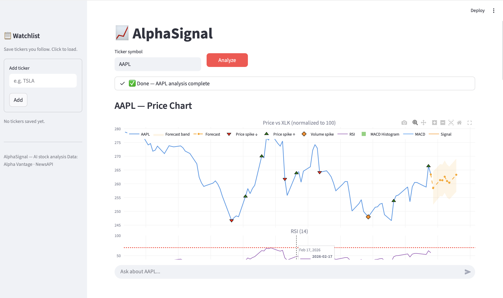
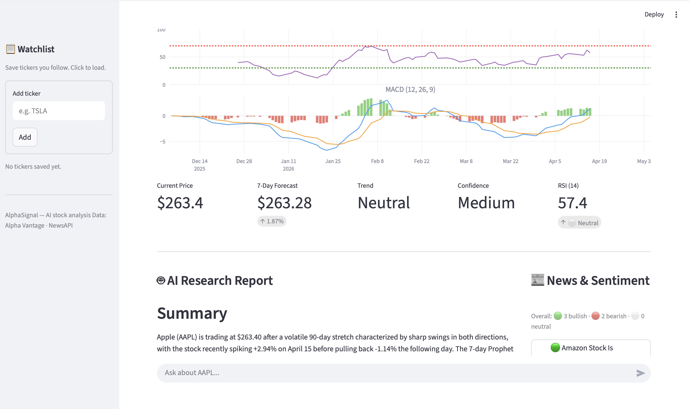

# AlphaSignal 📈

> Enter a stock ticker. Get anomaly detection, a 7-day forecast, sentiment-scored news, and a full AI research report — then chat with it.

An AI-powered stock analysis tool that combines quantitative signals with Claude's reasoning to generate plain-English research reports — and lets you have a conversation about them.

## What it does

Enter any stock ticker and AlphaSignal runs a full pipeline:

1. **Fetches 90 days** of daily price and volume data from Alpha Vantage
2. **Detects anomalies** across the full history — unusual price spikes, volume surges, flagged by z-score and rolling averages
3. **Forecasts 7 trading days ahead** using Facebook Prophet with confidence bands
4. **Computes RSI and MACD** technical indicators
5. **Fetches recent news** via NewsAPI, embeds headlines using sentence-transformers, stores in pgvector, and retrieves the most semantically relevant articles
6. **Scores news sentiment** locally using VADER (bullish / bearish / neutral per article)
7. **Overlays sector ETF** (e.g. XLK for tech) so you can see if a move is company-specific or sector-wide
8. **Generates an AI Research Report** via Claude Opus — synthesizing all signals into a structured plain-English report
9. **Chat interface** — ask Claude follow-up questions about the analysis with full data context

## Screenshot





## Tech stack

| Layer | Tool |
|---|---|
| UI | Streamlit |
| Price data | Alpha Vantage API |
| Forecasting | Facebook Prophet |
| Technical indicators | Custom (RSI, MACD) |
| News fetching | NewsAPI |
| News embeddings | sentence-transformers (`all-MiniLM-L6-v2`) |
| Vector search | pgvector (PostgreSQL) |
| Sentiment scoring | VADER |
| AI analysis + chat | Claude Opus 4.6 (Anthropic) |
| Charts | Plotly |

## Project structure

```
alphasignal/
├── src/
│   ├── data_fetcher.py          # Alpha Vantage price + sector ETF data
│   ├── anomaly_detector.py      # Z-score + volume spike detection (full 90-day history)
│   ├── forecaster.py            # Prophet 7-day forecast with confidence bands
│   ├── technical_indicators.py  # RSI and MACD calculations
│   ├── news_rag.py              # NewsAPI → embeddings → pgvector → retrieval + sentiment
│   ├── claude_analyst.py        # Claude report generation + chat streaming
│   └── app.py                   # Streamlit dashboard
├── .env                         # API keys (not committed)
├── requirements.txt
└── README.md
```

## Setup

### 1. Clone the repo

```bash
git clone https://github.com/DolasPooja99/AlphaSignal.git
cd AlphaSignal
```

### 2. Create a virtual environment

```bash
python3 -m venv venv
source venv/bin/activate
```

### 3. Install dependencies

```bash
pip install -r requirements.txt
```

### 4. Set up PostgreSQL with pgvector

```bash
brew install postgresql
brew services start postgresql
psql postgres -c "CREATE DATABASE alphasignal;"
psql alphasignal -c "CREATE EXTENSION vector;"
```

### 5. Configure API keys

Create a `.env` file in the project root:

```
ANTHROPIC_API_KEY=your-anthropic-key
ALPHAVANTAGE_API_KEY=your-alphavantage-key
NEWS_API_KEY=your-newsapi-key
DATABASE_URL=postgresql://your-username@localhost/alphasignal
```

Get your keys here:
- Anthropic: https://console.anthropic.com
- Alpha Vantage: https://www.alphavantage.co/support/#api-key (free tier: 25 requests/day)
- NewsAPI: https://newsapi.org (free tier: 100 requests/day)

### 6. Run the app

```bash
streamlit run src/app.py
```

Open http://localhost:8501 in your browser.

## Usage

1. Enter a ticker symbol (e.g. `AAPL`, `TSLA`, `MSFT`) in the input box
2. Click **Analyze** — the full pipeline runs in ~45–60 seconds
3. Explore the chart — RSI, MACD, anomaly markers, forecast band, sector overlay
4. Read the AI Research Report below the chart
5. Ask follow-up questions in the chat box at the bottom

### Watchlist

Save tickers you follow using the sidebar. Click any saved ticker to load it into the main input instantly.

## Key design decisions

**Why Prophet for forecasting?**
Prophet handles missing days (weekends, holidays) automatically and returns confidence intervals. We disable yearly seasonality (`yearly_seasonality=False`) because 90 days of data isn't enough to learn annual patterns — enabling it causes the model to produce nonsense mid-forecast spikes.

**Why pgvector for news?**
Storing embeddings in PostgreSQL means news articles persist across sessions and aren't re-fetched or re-embedded unless new articles are available. Semantic search lets us retrieve the most *relevant* articles for a ticker, not just the most recent ones.

**Why VADER for sentiment?**
VADER runs locally with no API cost, was designed for short news-style text, and is fast enough to score dozens of articles instantly. It's not as accurate as a fine-tuned financial sentiment model, but it's good enough for headline-level signal.

**Why prompt caching on Claude?**
The system prompt and stock data context are stable within a session. With `cache_control`, follow-up chat messages pay ~10% of the context token cost instead of full price — roughly a 6x cost reduction over a 10-message conversation.

## Rate limits

| API | Free tier limit |
|---|---|
| Alpha Vantage | 25 requests/day |
| NewsAPI | 100 requests/day |
| Anthropic | Pay per use |

Each analysis of a new ticker uses 2 Alpha Vantage calls (stock + sector ETF). Results are cached in memory for the session — re-clicking Analyze on the same ticker re-fetches fresh data.

## License

MIT
